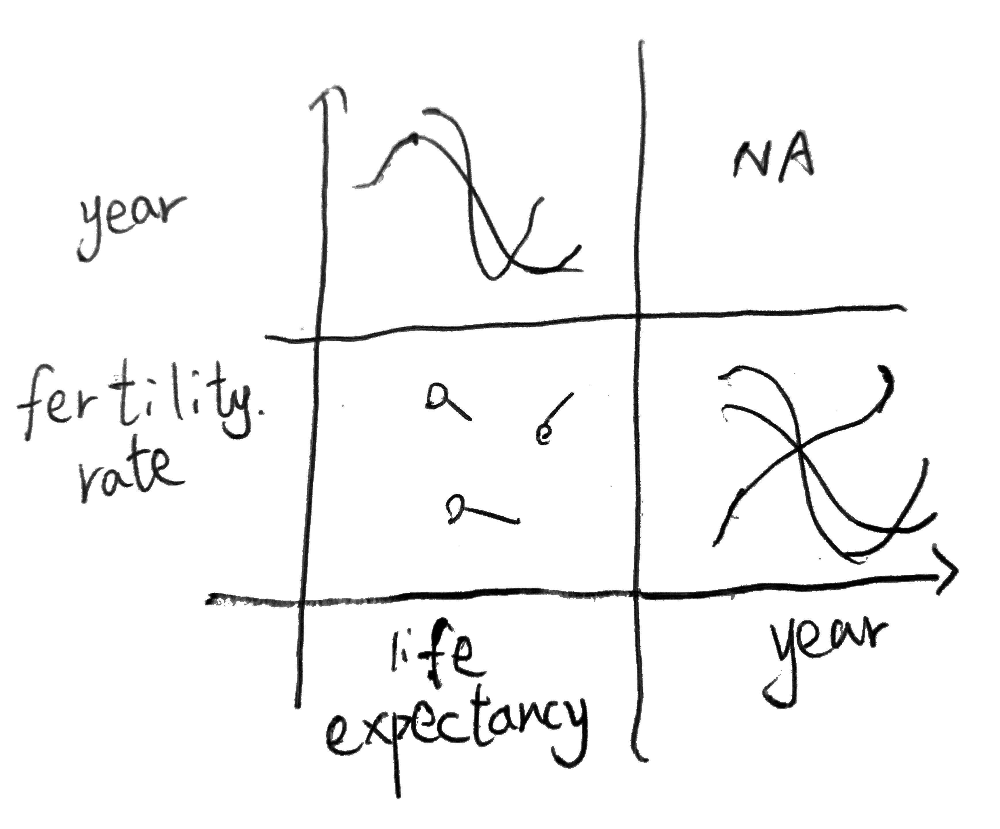

### Set up animint2 package

```{r setup}
knitr::opts_chunk$set(echo = TRUE)
library(animint2)
library(graphics)
library(devtools)
library(gistr)
gist_auth()
```

### Load data

```{r load-data}
data(WorldBank, package="animint2")
tail(WorldBank)
dim(WorldBank)
```

### Life expectancy against fertility rate

```{r life-expectancy-vs-fertility-rate, message=FALSE}
WorldBank1975 <- subset(WorldBank, year==1975)
head(WorldBank1975)
scatter <- ggplot()+
  geom_point(
    mapping=aes(x=life.expectancy, y=fertility.rate, color=region),
    data=WorldBank1975)
scatter
animint(scatter)
```

### Multiple geoms

```{r multi-geoms, message = FALSE, message=FALSE}
WorldBankBefore1975 <- subset(WorldBank, 1970 <= year & year <= 1975)
two.layers <- scatter+
  geom_path(aes(x=life.expectancy, y=fertility.rate, color=region,
                group=country),
            data=WorldBankBefore1975)
(viz.two.layers <- animint(two.layers))
```

# Exercise in section Multi-layer data visualization (multiple geoms)

Exercise: try changing the region legend to an income legend. Hint: you need to use the same aes(color=income) specification for all geoms. You may want to use scale_color_manual with a sequential color palette, see RColorBrewer::display.brewer.all(type="seq") and read the appendix for more details.

```{r exercise1, message = FALSE}
scatter.income <- ggplot()+
  geom_point(
    mapping=aes(x=life.expectancy, y=fertility.rate, color=income),
    data=WorldBank1975)
two.layers.income <- scatter.income+
  geom_path(aes(x=life.expectancy, y=fertility.rate, color=income,
                group=country),
            data=WorldBankBefore1975)
(viz.two.layers.income <- animint(two.layers.income))
```

### Add name of countries(three layers)

```{r three-layers, message = FALSE}
three.layers <- two.layers+
  geom_text(aes(x=life.expectancy, y=fertility.rate, color=region,
                label=country),
            data=WorldBank1975)
animint(three.layers)
```

### Multi-plot

```{r multi-plot, message=FALSE}
viz.two.plots <- viz.two.layers
viz.two.plots$timeSeries <- ggplot()+
  geom_line(aes(x=year, y=fertility.rate, color=region, group=country),
            data=WorldBank)
summary(viz.two.plots)
viz.two.plots
```

# Exercise in section Multi-plot data visualization

Exercise: use animint to create a data viz with three plots, by creating a list with three ggplots. For example, you could add a time series of another data variable such as life.expectancy or population.

```{r multi-plot-exercise, message=FALSE}

viz.three.plots <- viz.two.plots
viz.three.plots$pop <- ggplot()+
  geom_line(aes(x=population, y=fertility.rate, color=region, group=country),
            data=WorldBank)
summary(viz.three.plots)
viz.three.plots

```

### Different geoms in each panel (aligned axes)

```{r differnt-panel, message=FALSE}
add.x.var <- function(df, x.var){
  data.frame(df, x.var=factor(x.var, c("life expectancy", "year")))
}
(viz.aligned <- animint(
  scatter=ggplot()+
    geom_point(aes(x=life.expectancy, y=fertility.rate, color=region),
               data=add.x.var(WorldBank1975, "life expectancy"))+
    geom_path(aes(x=life.expectancy, y=fertility.rate, color=region,
                  group=country),
              data=add.x.var(WorldBankBefore1975, "life expectancy"))+
    geom_line(aes(x=year, y=fertility.rate, color=region, group=country),
              data=add.x.var(WorldBank, "year"))+
    xlab("")+
    facet_grid(. ~ x.var, scales="free")+
    theme_bw()+
    theme(panel.margin=grid::unit(0, "lines"))
  ))
```

### Same geoms in each panel (compare data subsets)

```{r same-panel, message=FALSE}
show.point.list <- list()
show.path.list <- list()
for(show.year in c(1975, 1985, 1995)){
  show.point.list[[paste(show.year)]] <- data.frame(
    show.year, subset(WorldBank, year==show.year))
  show.path.list[[paste(show.year)]] <- data.frame(
    show.year, subset(WorldBank, show.year - 5 <= year & year <= show.year))
}
show.point <- do.call(rbind, show.point.list)
show.path <- do.call(rbind, show.path.list)

viz.panels <- list(
  scatter=ggplot()+
    geom_point(aes(x=life.expectancy, y=fertility.rate, color=region),
               data=show.point)+
    geom_path(aes(x=life.expectancy, y=fertility.rate, color=region,
                  group=country),
              data=show.path)+
    facet_grid(. ~ show.year)+
    theme_bw()+
    theme(panel.margin=grid::unit(0, "lines"))
  )
structure(viz.panels, class="animint")
```

# Exercises at the end

-   What are the three main advantages of ggplot2 relative to previous plotting systems such as grid and lattice?\

1.  Compared to `lattice`, `ggplot2` has fewer limitations on types of plots.\
2.  Compared to general plotting system, `ggplot2` is easier to include common plot elements.\
3.  As `ggplots2` requires mapping from data variable to visual properties, it is easier to mapping the sketches into R code.\

-   What is the purpose of multi-layer graphics?\
    We use multi-layer graphics to display several geom layers/data varialbes in the same plot.\
-   What are the two different reasons for creating multi-panel graphics? Which of these two types is useful with interactivity?\

1.  We want to align different but related plots containing different geoms. e.g. Same y-axes but different x-axes.\
2.  We want to divide same data into several buckets.\
    The first one is more useful with interactivity. Because in first case, different panels usually has aligned axes, so we can compare different geoms.\

-   Let us define "A \< B" to mean that "one B can contain several A." Which of the following statements is true?\
    ggplot \< panel **False: one panel can contains only one plot**\
    panel \< ggplot **True**\
    ggplot \< animint **True: animint is a fork of ggplot**\
    animint \< ggplot **False**\
    layer \< panel **True: in the example `Different geoms in each panel (aligned axes)`, the first panel contains both path and point**\
    panel \< layer **True: in the example in `Same geoms in each panel (compare data subsets)`, the same layer is divided into three panels**\
    layer \< ggplot **True: That's one feature of ggplot**\
    ggplot \< layer **True: Same layer can be divided into differnt ggplots based on some filters**\
-   In the viz.aligned facets, why is it important to use the scales="free" argument?\
    Because the x-axes in two different panels have different units. If not free x-axes, two panels will have same scale.\
-   In viz.aligned we showed a ggplot with a scatterplot panel on the left and a time series panel on the right. Make another version of the data visualization with the time series panel on the left and the scatterplot panel on the right.\
"In particular, if we wanted to change the order of the panels in the data visualization, we would only need to edit the order of the factor levels in the definition of add.x.var."\
```{r change-order, message=FALSE}
add2.x.var <- function(df, x.var){
  data.frame(df, x.var=factor(x.var, c("year", "life expectancy")))
}
(viz.aligned.switch <- list(
  scatter=ggplot()+
    geom_point(aes(x=life.expectancy, y=fertility.rate, color=region),
               data=add2.x.var(WorldBank1975, "life expectancy"))+
    geom_path(aes(x=life.expectancy, y=fertility.rate, color=region,
                  group=country),
              data=add2.x.var(WorldBankBefore1975, "life expectancy"))+
    geom_line(aes(x=year, y=fertility.rate, color=region, group=country),
              data=add2.x.var(WorldBank, "year"))+
    xlab("")+
    facet_grid(. ~ x.var, scales="free")+
    theme_bw()+
    theme(panel.margin=grid::unit(0, "lines"))
  ))
animint2gist(viz.aligned.switch, description = "My animint plot", browse = TRUE)
#http://bl.ocks.org/Luna0618/raw/136edc11b06e4020dd6027a05dbf0e83/
```
- In viz.aligned the scatterplot displays fertility rate and life expectancy, but the time series displays only fertility rate. Make another version of the data visualization that shows both time series. Hint: use both horizontal and vertical panels in facet_grid.\
Sketch of the idea:\

{width=50%}
```{r both-time-series, message=FALSE}
add.vars <- function(df, x.var, y.var){
  data.frame(df, x.var=factor(x.var, c("life expectancy", "year")), y.var=factor(y.var,c("fertility rate", "year")))
}

(viz.aligned <- animint(
  scatter=ggplot()+
    geom_point(aes(x=life.expectancy, y=fertility.rate, color=region),
               data=add.vars(WorldBank1975, "life expectancy", "fertility rate"))+
    geom_path(aes(x=life.expectancy, y=fertility.rate, color=region,
                  group=country),
              data=add.vars(WorldBankBefore1975, "life expectancy", "fertility rate"))+
    geom_line(aes(x=year, y=fertility.rate, color=region, group=country),
              data=add.vars(WorldBank, "year", "fertility rate"))+
    geom_line(aes(x=life.expectancy, y=year,color=region, group=country),
              data=add.vars(WorldBank,"life expectancy","year"))+
    xlab("")+
    ylab("")+
    facet_grid(y.var~x.var, scales="free")+
    theme_bw()+
    theme(panel.margin=grid::unit(0, "lines"))
  ))

```
- Use aes(size=population) in the scatterplot to show the population of each country. Hint: scale_size_animint(pixel.range=c(5, 10) means that circles with a radius of 5/10 pixels should be used represent the minimum/maximum population.\
```{r scatter-pop, message = FALSE}
(viz.aligned.switch <- animint(
  scatter=ggplot()+
    geom_point(aes(x=life.expectancy, y=fertility.rate, color=region, size=population),
    data=WorldBank1975)
 + scale_size_animint(pixel.range=c(5,10))))
    
```
- Create a multi-panel data visualization that shows each year of the WorldBank data set in a separate panel. What are the limitations of using static graphics to visualize these data?\
```{r multi-panel, message=FALSE, warning=FALSE}
min(WorldBank$year)
max(WorldBank$year)
#min=1960 max =2012
show.point.list <- list()
years <- levels(as.factor(WorldBank$year))
for(show.year in years){
  show.point.list[[paste(show.year)]] <- data.frame(
    show.year, subset(WorldBank, year==show.year))
}
show.point <- do.call(rbind, show.point.list)

viz.panels.all <- list(
  scatter=ggplot()+
    geom_point(aes(x=life.expectancy, y=fertility.rate, color=region),
               data=show.point)+
    facet_grid(. ~ show.year)+
    theme_bw()+
    theme(panel.margin=grid::unit(0, "lines"))
  )

#Please run 
#devtools::install_github('rOpenSci/gistr')before using this function
#animint2gist(viz.panels.all, description = "My animint plot", browse = TRUE)
#http://bl.ocks.org/Luna0618/raw/64b127c5d0b96f4594c96180e6ea767b/
```
Using the plot I created as an exaple. In this case, as the minimal year is 1960 and maximum is 2012, there will be 52 panels. If it's done using a static graph, there will be too many data points overlap with each other, we cannot see the details for each region. But with interactive graph, we can show data points from selected regions.\

- Create viz.aligned using a plotting system that is not based on the grammar of graphics. For example, you can use functions from the graphics package in R (plot, points, lines, etc), or matplotlib in Python. What are some advantages of ggplot2 and animint?
```{r non-grammar-of-graph}

par(mfrow=c(1,2))
plot(x=WorldBank1975$life.expectancy, y=WorldBank1975$fertility.rate,col=WorldBank1975$region)

legend("topright",cex = 0.5, legend=c(levels(as.factor(WorldBank$region))),
       fill=WorldBank1975$region)

plot(x=WorldBank$year,y=WorldBank$fertility.rate,type='l')
```

When we don't use the grammar of graphics, each component of the plot is separate. For example, we cannot add scatter points and lines as layers to the same graph, we have to make two plots and plot them separately. We also have to create a legend on top of this. But when it comes to packages using grammar of graphics, as `ggplot2` and `animint`, we have a single canvas and keep adding layers to it.